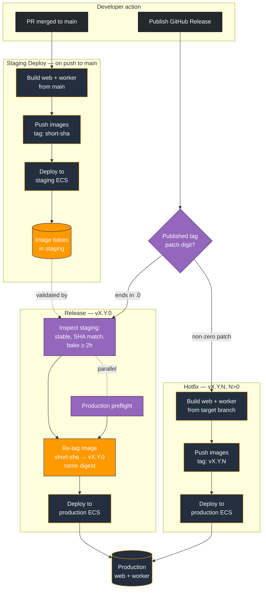

# Deployment Pipeline

This directory documents how Sandpiper code reaches its running environments. There are three workflows, each documented in its own file:

| Workflow           | File                         | Trigger                                   | What it does                                                                      |
| ------------------ | ---------------------------- | ----------------------------------------- | --------------------------------------------------------------------------------- |
| **Staging Deploy** | [`staging.md`](./staging.md) | push to `main`                            | Builds `web` + `worker` from source, pushes SHA-tagged images, deploys to staging |
| **Release**        | [`release.md`](./release.md) | published Release, tag `vX.Y.0`           | Promotes a validated staging image to production by re-tag (no rebuild)           |
| **Hotfix**         | [`hotfix.md`](./hotfix.md)   | published Release, tag `vX.Y.N` (`N > 0`) | Builds from a chosen branch and deploys straight to production                    |

All three share a common spine — GitHub OIDC into environment-scoped IAM roles, a single shared ECR repository (`sandpiper`) where web and worker are distinguished only by a `-worker` tag suffix, and the same reusable building blocks (`ecs_build_image.yml`, `ecs_deploy_service.yml`, `deployment_summary.yml`, `ecs_preflight.yml`). They differ in how an artifact comes to exist and how much validation stands between it and production.

## The model in one paragraph

Every commit merged to `main` is built once by **Staging** and tagged with its short commit SHA. That image runs in staging. When it's time to ship, **Release** doesn't rebuild — it takes the exact image that has been baking in staging and re-tags its manifest under a version (`vX.Y.0`), so the bytes in production are provably the same bytes that ran in staging. **Hotfix** is the escape hatch from that model: when something is on fire and there's no time (or no healthy staging) to promote through, it builds the fix from a branch of your choosing and deploys it directly as `vX.Y.N`.

## Build once, promote — and the hotfix exception

The normal path is **build-once-promote-digest**: one build (staging), one set of bytes, re-tagged forward to production. This is what makes a release auditable — the production image shares a digest with the staging image, and you can prove the lineage.

A hotfix breaks that lineage on purpose. It builds new bytes outside the staging path, trading the "same digest" guarantee for the ability to ship a fix immediately and to recover a production cluster that's too unhealthy for the release workflow's gates to ever pass. The two paths are mutually exclusive by construction (see the trigger split below), so you can't accidentally do both for one version.

## The shared trigger, split by patch digit

`Release` and `Hotfix` listen to the **same** event — `release: published` — and decide which one owns a given tag by inspecting the patch digit:

- `vX.Y.0` (patch digit **zero**) → **Release** claims it; `Hotfix` skips as a neutral run.
- `vX.Y.N`, `N > 0` (patch digit **non-zero**) → **Hotfix** claims it; `Release` skips as a neutral run.

The split is a job-level `if:` guard on each workflow's first job (`endsWith(tag_name, '.0')` for Release, its negation for Hotfix), because GitHub's `on:` block can't filter on version. Whichever workflow doesn't own the tag skips cleanly — grey, not red — so a published release never produces a spurious failure on the other workflow. The two also run in **separate concurrency groups** (`production-release` vs `production-hotfix`), so an emergency hotfix is never stuck queued behind an in-flight normal release.

## End-to-end flow

## How the three compare

| Dimension           | Staging                                   | Release                               | Hotfix                          |
| ------------------- | ----------------------------------------- | ------------------------------------- | ------------------------------- |
| Trigger             | push to `main`                            | publish `vX.Y.0`                      | publish `vX.Y.N` (`N > 0`)      |
| Source of image     | builds from `main`                        | re-tags staging image                 | builds from target branch       |
| Builds from source? | yes                                       | no (promote by digest)                | yes                             |
| Pre-deploy gates    | preflight                                 | resolve + inspect-staging + preflight | none (by design)                |
| Post-deploy safety  | rollback trap + circuit breaker           | rollback trap + circuit breaker       | rollback trap + circuit breaker |
| Concurrency group   | `staging-deployment` (cancel-in-progress) | `production-release` (queue)          | `production-hotfix` (queue)     |
| Image tag           | `<short-sha>`                             | `<version>`                           | `<version>`                     |
| Bake requirement    | n/a                                       | ≥ 2h in staging                       | none                            |

The consistent thread: all three keep the **same post-deploy safety nets** (the rollback trap in `ecs_deploy_service.yml` plus the Terraform-configured ECS circuit breaker). What varies is the _pre-deploy_ validation. Staging has a light preflight; Release stacks the full set of gates that earn the promote-by-digest guarantee; Hotfix deliberately drops the pre-deploy gates so it can act on a cluster too unhealthy for those gates to pass — relying on the post-deploy nets to catch a bad fix.

## Reusable building blocks

These reusable workflows are shared across the three pipelines. Local ones live in `.github/workflows/` in this repo; the others live in the `National-Tutoring-Observatory/workflows` repo and are referenced `@main`.

| Workflow                 | Location       | Used by          | Role                                                                               |
| ------------------------ | -------------- | ---------------- | ---------------------------------------------------------------------------------- |
| `ecs_build_image.yml`    | local          | staging, hotfix  | Build + push an image; takes an optional `ref` to build a specific branch          |
| `ecs_deploy_service.yml` | workflows repo | all three        | Register a new task-def revision, update service, wait stable, rollback on failure |
| `ecs_preflight.yml`      | workflows repo | staging, release | Wait for a service's current deployment to stabilise                               |
| `deployment_summary.yml` | workflows repo | all three        | Write the run summary to `$GITHUB_STEP_SUMMARY`                                    |
| `resolve_release.yml`    | workflows repo | release          | Validate tag format + commit-on-main; output the version string                    |
| `inspect_staging.yml`    | local          | release          | Validate staging stability, SHA match, and bake duration                           |
| `ecs_promote_image.yml`  | local          | release          | Re-tag an ECR manifest from the staging SHA to the release version                 |
