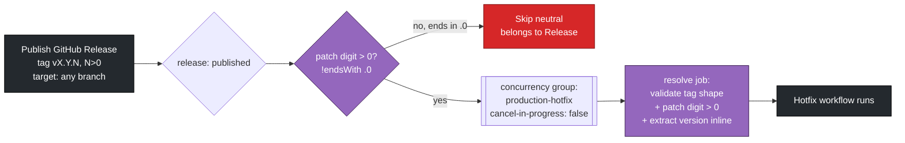
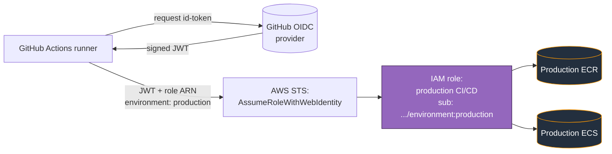
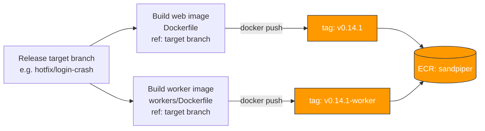
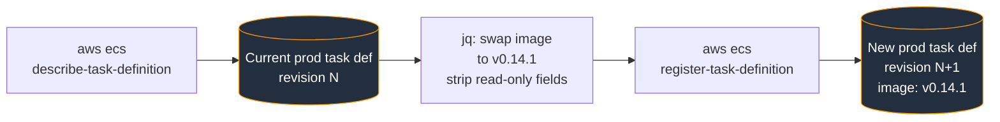
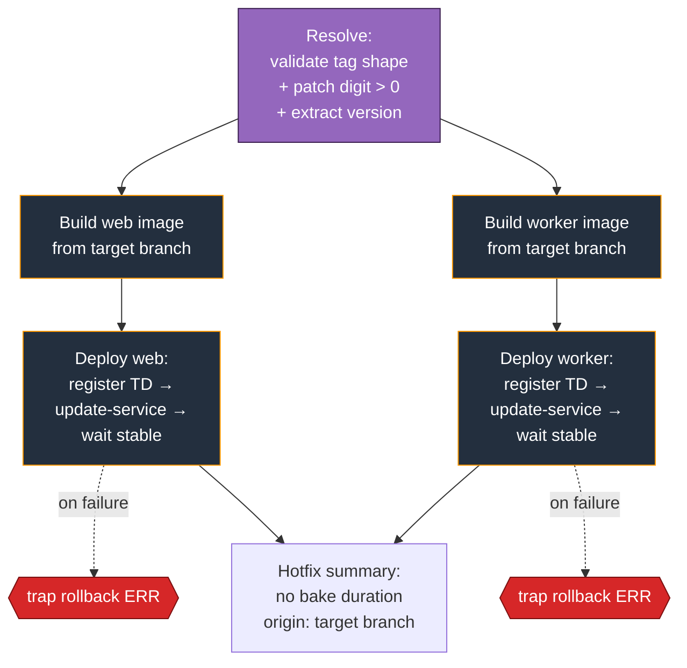

## Hotfix

### Overview

The `Hotfix` workflow is the emergency path to production. Unlike `Release`, which promotes a staging-validated image without rebuilding, `Hotfix` **builds the `web` and `worker` images from source** and deploys them straight to the production ECS services. It exists for the situations the normal release model can't serve: a fix that hasn't been through staging, or a production cluster in a bad enough state that the release workflow's validation gates would never pass.

It is deliberately the leanest path to production. It skips the staging-inspection and the production-preflight gates that `Release` relies on, because those gates assume a healthy baseline — and a hotfix is precisely the tool you reach for when that assumption is broken. The trade is explicit: speed and recoverability in exchange for the "bytes that ran in staging are the bytes that ship" guarantee.

`Hotfix` and `Release` are triggered by the **same event** — a published GitHub Release — and are separated only by the patch digit of the tag. A tag whose patch digit is zero (`vX.Y.0`) is a normal release and is claimed by `Release`; a tag with a non-zero patch digit (`vX.Y.N`, `N > 0`) is a hotfix and is claimed by this workflow. Each workflow skips, as a neutral (not failed) run, any tag that isn't its own.

Key properties:

- **Trigger:** publish of a GitHub Release whose tag has a non-zero patch digit (`vX.Y.N`, `N > 0`)
- **Concurrency:** group `production-hotfix`, `cancel-in-progress: false` (own group — a hotfix is never queued behind a normal release)
- **Auth:** GitHub OIDC → dedicated production IAM role
- **Image registry:** ECR repo `sandpiper`, built from source and tagged `<version>` (web) and `<version>-worker` (worker)
- **Deploy target:** production ECS cluster, web + worker services
- **Safety:** no staging-inspection or preflight gate (by design); retains the deploy job's rollback trap from `ecs_deploy_service.yml` and the ECS circuit breaker
<details>
<summary><b>GitHub Action Trigger</b></summary>
The workflow runs on `release: published`. There is no `workflow_dispatch` and no tag-push trigger — a hotfix, like a normal release, must come from a published GitHub Release, which gives it a permanent audit trail.

```yaml
on:
  release:
    types: [published]
```

Because `release: published` fires for _every_ published release regardless of version, the split between a normal release and a hotfix cannot be expressed in the `on:` block. It is enforced instead as a job-level `if:` on the first job, `resolve`:

```yaml
if: ${{ !endsWith(github.event.release.tag_name, '.0') }}
```

This claims tags that do **not** end in `.0` — i.e. those with a non-zero patch digit. `Release` carries the mirror-image guard (`endsWith(..., '.0')`). Every other job in the workflow chains off `resolve` via `needs:`, so when the guard is false the whole pipeline skips as a neutral run. A normal `vX.Y.0` release therefore leaves `Hotfix` grey, not red.

The expected developer flow:

1. Push the fix to a branch — a release branch, a revert, or `main`, whichever gets you out of trouble fastest.
2. Publish a GitHub Release from the Releases UI, tagging it `vX.Y.N` with `N > 0` (e.g. `v0.14.1`), and selecting the branch with the fix as the release target.
3. `Hotfix` builds that target branch and deploys it to production.
   Concurrency uses its **own** group, `production-hotfix`, with `cancel-in-progress: false`. This is deliberately distinct from `Release`'s `production-release` group: a hotfix exists to get production out of trouble, so it must not sit queued behind an in-flight normal release. The two run in independent concurrency lanes.

Unlike `Release`, `resolve` here does **not** check that the tagged commit is reachable from `main`. A hotfix may legitimately ship from a branch that isn't `main`, so that reachability gate is intentionally absent. The version is extracted inline (no call to `resolve_release.yml`) to keep the path self-contained and fast: the tag is validated against the strict `^v[0-9]+\.[0-9]+\.[0-9]+$` shape, the patch digit is confirmed non-zero, and the leading `v` is stripped for the version string used downstream.



</details>
<details>
<summary><b>GitHub to AWS Authentication</b></summary>
Authentication uses **GitHub OIDC** — the same mechanism as `Staging Deploy` and `Release`, with no long-lived AWS keys stored anywhere.
 
Every job in `Hotfix` that touches AWS runs against `environment: production` and assumes the **production** CI/CD role. There is no staging-facing job here (no inspection step), so — unlike `Release` — the workflow never assumes the staging role. This is simpler than the release auth model: one environment, one role, throughout.
 
The production role's trust policy restricts `sts:AssumeRoleWithWebIdentity` to a single `sub` referencing the `production` GitHub environment, so only jobs that declare `environment: production` can assume it.
 
**Variables and secrets looked up by the workflow** (all resolved against the `production` environment):
 
| Name | Type | Used by | Purpose |
|---|---|---|---|
| `AWS_ROLE_ARN` | var | all AWS jobs | Production CI/CD role ARN |
| `BULLMQ_PRO_TOKEN` | secret | build jobs | Yarn registry token for the BullMQ Pro package, passed as a BuildKit secret |
| `ECR_REPOSITORY` | var | `ecs_build_image.yml` | ECR repo name (`sandpiper`) |
| `ECS_CLUSTER` | var | deploy | Production ECS cluster |
| `ECS_SERVICE` | var | deploy (web) | Production web service |
| `ECS_CONTAINER_NAME` | var | deploy (web) | Container name inside the web task definition |
| `ECS_WORKER_CLUSTER` | var | deploy (worker) | Production ECS cluster |
| `ECS_WORKER_SERVICE` | var | deploy (worker) | Production worker service |
| `ECS_WORKER_CONTAINER_NAME` | var | deploy (worker) | Container name inside the worker task definition |
 
> **Note:** because the build jobs run against `environment: production`, `BULLMQ_PRO_TOKEN` must be defined at the **production** environment scope. Staging's builds resolve the same secret against `environment: staging`; the two are separate secret scopes. If the token exists only on staging, the hotfix build resolves it as empty and silently drops the BuildKit secret.
 

 
</details>
<details>
<summary><b>AWS ECR</b></summary>
Unlike `Release`, which re-tags an existing manifest, `Hotfix` **builds new image bytes** and pushes them. It uses the same reusable build workflow as `Staging Deploy` — `ecs_build_image.yml` — with one difference that matters: it passes a `ref` so the build checks out the **release's target branch** rather than the default branch.
 
On a `release: published` event the workflow context runs from the repository's default branch, so a bare checkout would build `main` regardless of which branch the release targeted. To honour the branch selected in the Releases UI, `Hotfix` passes `ref: ${{ github.event.release.target_commitish }}` into `ecs_build_image.yml`, which threads it into `actions/checkout`. (When that input is empty — as it is for staging — checkout falls back to the triggering ref, so the shared workflow's behaviour for other callers is unchanged.)
 
The build job, for each of web and worker:
 
1. Checks out the release's target branch (`ref` input)
2. Configures AWS credentials via OIDC and logs in to ECR
3. Resolves `ACCOUNT_ID` and builds the full ECR URI: `<account>.dkr.ecr.us-east-1.amazonaws.com/sandpiper`
4. `docker build` with the appropriate Dockerfile (`Dockerfile` for web, `workers/Dockerfile` for worker), passing `BULLMQ_PRO_TOKEN` as a BuildKit secret
5. `docker tag` and `docker push` under the version tag — `<version>` for web, `<version>-worker` for worker (e.g. `v0.14.1` and `v0.14.1-worker`)
6. Emits the fully-qualified image URI as the job output, consumed by the matching deploy job
Note the tagging difference from staging: staging tags by short SHA (`<short-sha>`), whereas a hotfix tags directly by the release version (`<version>`), because there is no later promote step to apply the version tag — the hotfix builds and deploys the version-tagged image in one pass.
 

 
</details>
<details>
<summary><b>AWS ECS Task Definitions</b></summary>
Task definition handling is identical to `Staging Deploy` and `Release`: the workflow does not register task definitions from a JSON file in the repo. The deploy job (`ecs_deploy_service.yml`) takes the live production task definition currently attached to the service, swaps the container image, and registers the result as a new revision. Env vars, secrets, CPU/memory, and log config all come from whatever Terraform has applied to production, untouched — the pipeline only ever changes the `image` field.
 
For the chosen service (`web` or `worker`):
 
1. `aws ecs describe-services` → capture the current task definition ARN as `OLD_TD_ARN` (used by the rollback trap)
2. `aws ecs describe-task-definition` → dump the full task def to `td.json`
3. `jq` rewrites it: replace `image` on the matching container, strip the read-only fields ECS rejects on register (`revision`, `status`, `taskDefinitionArn`, `requiresAttributes`, `compatibilities`, `registeredAt`, `registeredBy`)
4. `aws ecs register-task-definition` → returns `NEW_TD_ARN`
The new `image` value is the freshly-built, version-tagged image URI from the build step (e.g. `<account>.dkr.ecr.us-east-1.amazonaws.com/sandpiper:v0.14.1`).
 

 
</details>
<details>
<summary><b>AWS ECS Deployments</b></summary>
A hotfix runs in three phases. The defining feature is what's *absent*: there is no staging-inspection gate and no production-preflight gate. `Release` waits for production's current deployment to stabilise before proceeding; `Hotfix` does not, because if the cluster is wedged, that wait would never end — and un-wedging it is the hotfix's whole purpose.
 
**1. Resolve.** Validates the tag shape, confirms the patch digit is non-zero, and extracts the version string inline. No `main`-reachability check, no `resolve_release.yml` call. (See the Trigger section.)
 
**2. Build (web + worker in parallel).** Builds both images from the release's target branch and pushes them version-tagged. (See the ECR section.) Both must succeed before the matching deploy runs.
 
**3. Deploy with rollback (`ecs_deploy_service.yml`, web + worker in parallel).** Identical mechanics to the staging and release deploy jobs: register the new task definition revision, `update-service`, `wait services-stable`, with a `trap rollback ERR` that reverts to the previous task definition revision if any AWS command fails. Production also has the ECS circuit breaker enabled via Terraform, providing a second layer of automatic rollback for failed health checks or task start failures. So while the hotfix path drops the *pre-flight* safety gates, it keeps both *post-deploy* safety nets — which is what makes it safe to point at a troubled cluster.
 
**4. Summary (`deployment_summary.yml`).** Writes a markdown table to `$GITHUB_STEP_SUMMARY` with the deployed image URIs, total run duration, and per-job timings. Unlike the release summary, it carries no bake duration — a hotfix doesn't bake — and the originating reference recorded is the target branch the build came from rather than a promoted staging SHA.
 

 
</details>
