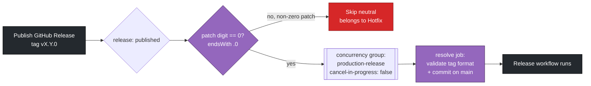
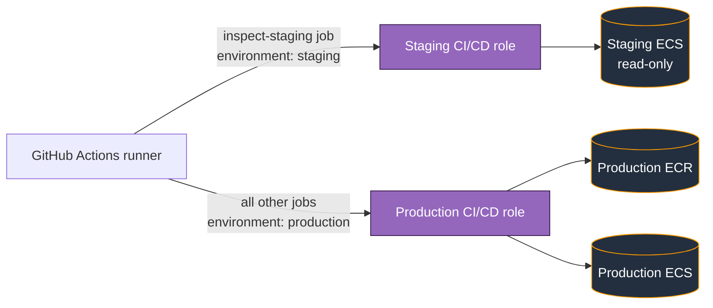
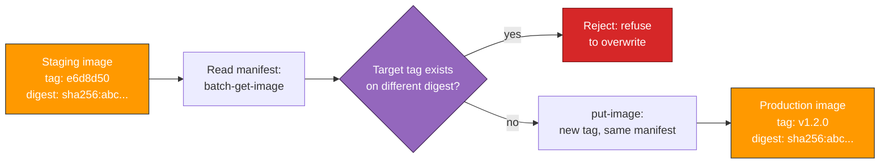
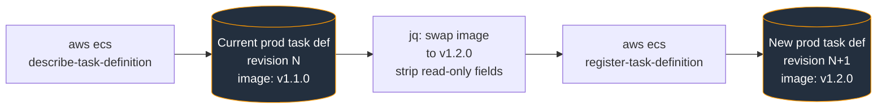
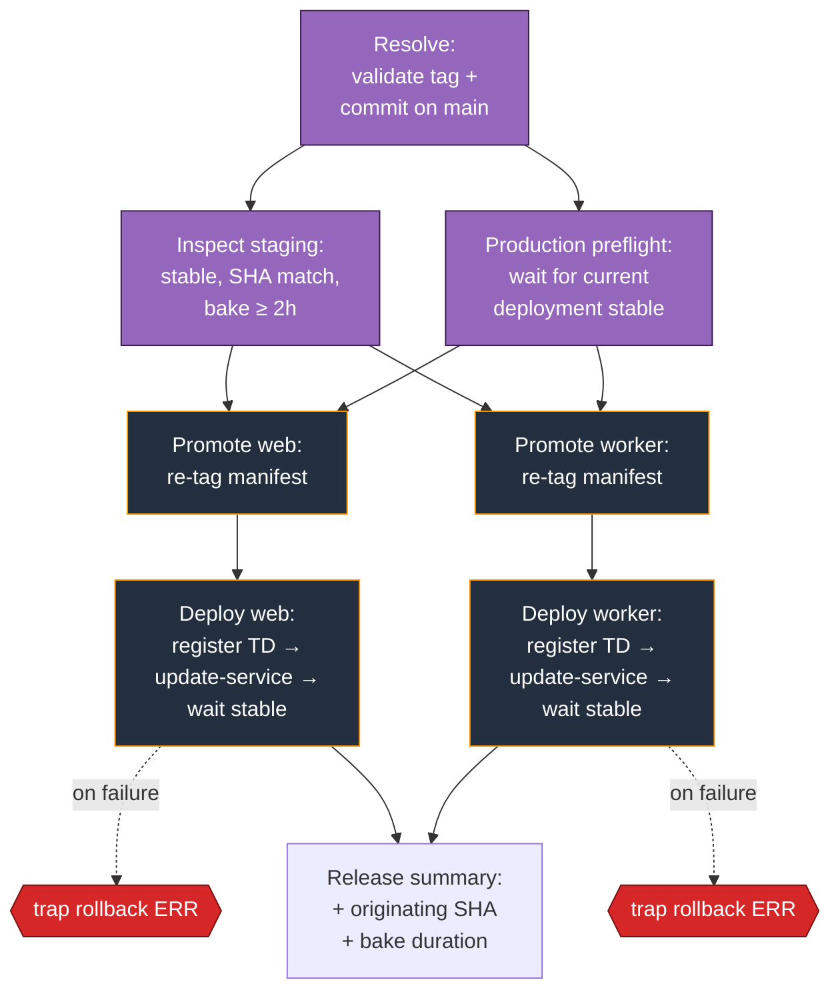

## Release

### Overview

The `Release` workflow promotes a staging build to production. Unlike `Staging Deploy`, it **does not build from source**. It re-tags an existing ECR image — the same bytes that have been running and validated in staging — under a release version tag (`vX.Y.Z`), then rolls the production ECS services onto that image.

This is the "build once, promote digest" model: the bytes that ran in staging are the bytes that ship to production. The release workflow's job is to _validate_ that staging is in a fit state to promote, _re-tag_ the image, and _deploy_. It is not, at any point, a build.

The workflow is triggered by publishing a GitHub Release whose tag is a normal-release version — `vX.Y.0`, with a patch digit of zero. Before any production resources are touched, it confirms:

- The tag matches the strict `vX.Y.Z` shape (no suffixes, no hotfix variants)
- The tagged commit exists on `main`
- Staging is currently running that exact commit
- Staging has been stable for at least 2 hours
- Production is itself stable (no in-flight deployment)
  Only then does it re-tag and deploy. The hotfix path — for releases that build from source and skip staging validation — runs through a separate workflow (`Hotfix`) and is documented in `hotfix.md`.

Key properties:

- **Trigger:** publish of a GitHub Release whose tag has a patch digit of zero (`vX.Y.0`)
- **Concurrency:** group `production-release`, `cancel-in-progress: false` (releases queue, never cancel)
- **Auth:** GitHub OIDC → dedicated production IAM role
- **Image registry:** ECR repo `sandpiper`, source tag `<short-sha>`, target tag `<version>`
- **Deploy target:** production ECS cluster, web + worker services
- **Safety:** five validation gates before any production resource is mutated, plus the deploy job's rollback trap inherited from `ecs_deploy_service.yml`
<details>
<summary><b>GitHub Action Trigger</b></summary>
The workflow runs on the publish of a GitHub Release. There is no `workflow_dispatch` and no tag-push trigger — releases come from a published Release, which gives them a permanent audit trail.

```yaml
on:
  release:
    types: [published]
```

The expected developer flow is to publish a Release from the GitHub UI, tagging it `vX.Y.0` on a commit that is already on `main`. (Equivalently, pushing the tag and then publishing a Release from it.)

`Release` and `Hotfix` share this exact trigger — both fire on `release: published` — and are separated only by the patch digit of the tag. Because `release: published` fires for every release regardless of version, the split cannot live in the `on:` block; it is enforced as a job-level `if:` on the first job, `resolve`:

```yaml
if: ${{ endsWith(github.event.release.tag_name, '.0') }}
```

This claims only normal-release tags — those ending in `.0`. `Hotfix` carries the mirror-image guard (`!endsWith(..., '.0')`). Every downstream job chains off `resolve` via `needs:`, so when the guard is false the whole pipeline skips as a neutral run: a hotfix `vX.Y.N` (`N > 0`) publish leaves `Release` grey, not red.

> The `endsWith` test is a string check, so `v1.2.0` matches while `v1.2.10` (ends in `.10`) and `v1.2.3` do not. It is only a router — `resolve_release.yml` still applies the strict `^v[0-9]+\.[0-9]+\.[0-9]+$` regex downstream as the real format gate.

Concurrency is set to `production-release` with `cancel-in-progress: false`. This is the opposite of staging's policy: production releases must never be cancelled mid-flight. If two release tags are published in quick succession, the second queues behind the first rather than racing it. (`Hotfix` uses a _separate_ concurrency group, `production-hotfix`, so an emergency fix is never stuck queued behind a normal release.)

The first job, `resolve` (`resolve_release.yml`), is the trigger's first line of defence. It checks two things:

1. The tag matches `^v[0-9]+\.[0-9]+\.[0-9]+$` exactly — digits only, no suffixes. A previous version of this workflow accepted a `-hotfix` suffix that skipped downstream validation; that path has been removed and now lives in a dedicated hotfix workflow.
2. The tagged commit is reachable from `origin/main`. Tags placed on branch commits, or on commits that have been rebased out of `main`, are rejected here.



</details>
<details>
<summary><b>GitHub to AWS Authentication</b></summary>
Authentication uses **GitHub OIDC** — the same mechanism as `Staging Deploy`, with a different role on the AWS side.
 
The release workflow assumes the **production** CI/CD role, whose trust policy restricts `sts:AssumeRoleWithWebIdentity` to a single `sub` referencing the `production` GitHub environment. Workflows that don't declare `environment: production` on the job cannot assume it.
 
There is one subtlety worth calling out: the `inspect-staging` job runs against the **staging** environment (it needs to read staging's ECS state), so it assumes the *staging* CI/CD role rather than the production role. This is why `inspect_staging.yml` reads `AWS_ROLE_ARN` from `vars` (resolved against `environment: staging`) instead of taking it as a passed-in secret — production never gets credentials that can read staging.
 
Everything else in the workflow — preflight, promote, deploy, summary — runs against `environment: production` and uses the production role.
 
**Variables and secrets looked up by the workflow:**
 
| Name | Type | Environment | Used by | Purpose |
|---|---|---|---|---|
| `AWS_ROLE_ARN` | var | staging | `inspect-staging` | Staging CI/CD role, for reading staging ECS state |
| `AWS_ROLE_ARN` | var | production | all other AWS jobs | Production CI/CD role |
| `ECR_REPOSITORY` | var | both | inspect + promote | ECR repo name (`sandpiper`) |
| `ECS_CLUSTER` | var | staging | inspect | `staging-nto` |
| `ECS_SERVICE` | var | staging | inspect | Staging web service |
| `ECS_WORKER_SERVICE` | var | staging | inspect | Staging worker service |
| `ECS_CLUSTER` | var | production | preflight + deploy | Production ECS cluster |
| `ECS_SERVICE` | var | production | preflight + deploy (web) | Production web service |
| `ECS_CONTAINER_NAME` | var | production | deploy (web) | Container name inside the web task definition |
| `ECS_WORKER_CLUSTER` | var | production | deploy (worker) | Production ECS cluster |
| `ECS_WORKER_SERVICE` | var | production | deploy (worker) | Production worker service |
| `ECS_WORKER_CONTAINER_NAME` | var | production | deploy (worker) | Container name inside the worker task definition |
 

 
</details>
<details>
<summary><b>AWS ECR</b></summary>
The release workflow does not push new image bytes to ECR. It re-tags an existing image manifest.
 
The `inspect-staging` job (`inspect_staging.yml`) reads the live task definitions on the staging web and worker services, extracts the `image` URIs, and parses out the tag — which by convention is the 7-character short SHA produced by `Staging Deploy`. It then validates:
 
1. **Stability** — both staging services have exactly one deployment in `COMPLETED` state, with `runningCount == desiredCount`. Polls every 15s for up to 600s.
2. **SHA match** — the web tag and the worker tag (minus the `-worker` suffix) refer to the same SHA. A mismatched pair means staging is mid-deploy or someone deployed web and worker from different commits, neither of which is safe to promote.
3. **Tag matches release commit** — the staging SHA equals the first 7 characters of the git SHA the release tag points at. If you tag a commit that staging hasn't validated, the release is rejected.
4. **Bake duration** — the older of the two services' `updatedAt` timestamps is at least 2 hours in the past. Both services need to have been stable for the full bake window, not just one.
Once inspection passes, the `promote-web` and `promote-worker` jobs (`ecs_promote_image.yml`) re-tag the image:
 
1. `aws ecr batch-get-image` reads the raw manifest JSON of the source tag
2. `aws ecr describe-images` resolves the source digest, and checks whether the target tag already exists on a *different* digest — if so, the promote is rejected with a clear error (this catches the case of accidentally re-using a version number on a new commit)
3. `aws ecr put-image` submits the same manifest JSON under the new tag
Because ECR deduplicates by digest, no bytes are uploaded. The same `sha256:...` digest now has two tags: the original `<short-sha>` and the new `<version>`. This is what makes the model auditable: the image running in production has the literal same digest as the image that ran in staging, and you can prove it.
 
The worker follows the same pattern with its suffix: source `<short-sha>-worker` → target `<version>-worker`.
 
If `put-image` returns `ImageAlreadyExistsException` because the target tag already points at the same digest (a re-run of the same release), the job treats it as a no-op rather than a failure.
 

 
</details>
<details>
<summary><b>AWS ECS Task Definitions</b></summary>
Task definition handling is identical to `Staging Deploy`: the workflow does not register task definitions from a JSON file in the repo. The deploy job (`ecs_deploy_service.yml`) takes the live production task definition currently attached to the service, swaps the container image, and registers the result as a new revision. Everything else — env vars, secrets, CPU/memory, log config — comes from whatever Terraform has applied to production, untouched.
 
For the chosen service (`web` or `worker`):
 
1. `aws ecs describe-services` → capture the current task definition ARN as `OLD_TD_ARN` (used by the rollback trap)
2. `aws ecs describe-task-definition` → dump the full task def to `td.json`
3. `jq` rewrites it: replace `image` on the matching container, strip the read-only fields ECS rejects on register (`revision`, `status`, `taskDefinitionArn`, `requiresAttributes`, `compatibilities`, `registeredAt`, `registeredBy`)
4. `aws ecs register-task-definition` → returns `NEW_TD_ARN`
The new `image` value is the freshly-promoted image URI from the previous step (e.g. `<account>.dkr.ecr.us-east-1.amazonaws.com/sandpiper:v1.2.0`).
 

 
</details>
<details>
<summary><b>AWS ECS Deployments</b></summary>
A production release runs five sequential phases, with web and worker promoting and deploying in parallel where possible.
 
**1. Resolve (`resolve_release.yml`).** Validates the tag format and that the commit is on `main`. Outputs the bare version string (without leading `v`) for downstream jobs to tag with. Runs only when the published tag's patch digit is zero (see the Trigger section); a non-zero patch digit skips the whole workflow as neutral and is handled by `Hotfix`.
 
**2. Inspect staging (`inspect_staging.yml`).** The four validation checks described in the ECR section: staging stable, web/worker on the same SHA, that SHA matches the tagged commit, baked for ≥2h. This is the most opinionated gate in the workflow — it's the one that gives the release model its "the bytes that ran in staging are the bytes that ship to production" guarantee.
 
**3. Preflight production (`ecs_preflight.yml`).** Same reusable workflow as staging, run against the production environment. Waits for production's current deployment (if any) to reach `COMPLETED` before allowing the release to proceed. Runs in parallel with `inspect-staging` since they query different environments and don't depend on each other.
 
**4. Promote (`ecs_promote_image.yml`, web + worker in parallel).** Re-tags the staging image under the release version. See the ECR section for detail. Both must succeed before either deploy runs.
 
**5. Deploy with rollback (`ecs_deploy_service.yml`, web + worker in parallel).** Identical mechanics to the staging deploy job: register new task definition revision, `update-service`, `wait services-stable`, with a `trap rollback ERR` that reverts to the previous task definition revision if any AWS command fails. Production also has the ECS circuit breaker enabled via Terraform, which provides a second layer of automatic rollback for failed health checks or task start failures.
 
**6. Summary (`deployment_summary.yml`).** Writes a markdown table to `$GITHUB_STEP_SUMMARY` with the deployed image URIs, total run duration, per-job timings, and — uniquely for production releases — the originating staging SHA and bake duration, so the audit trail captures *which* staging build was promoted and how long it had baked.
 

 
</details>
