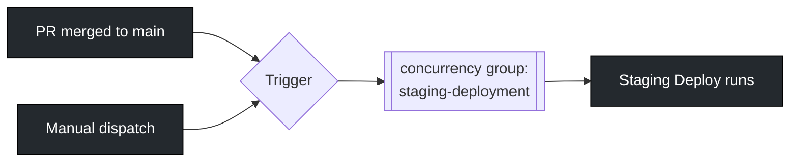
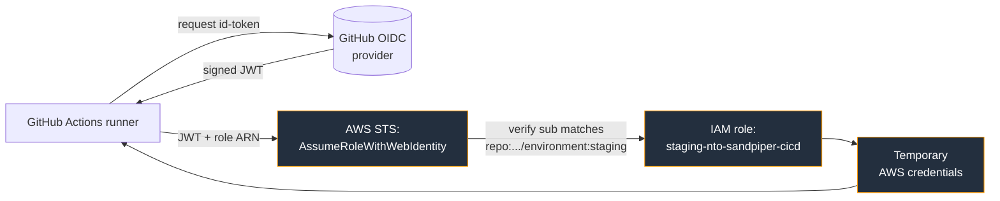
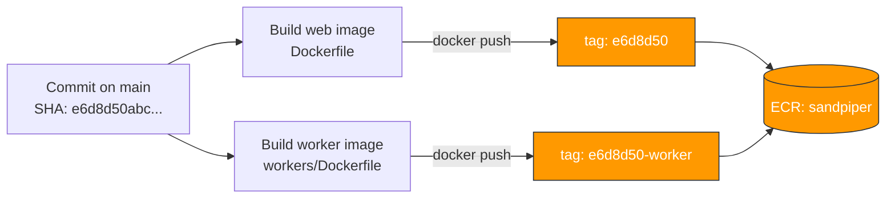
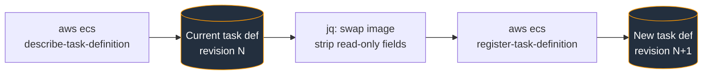
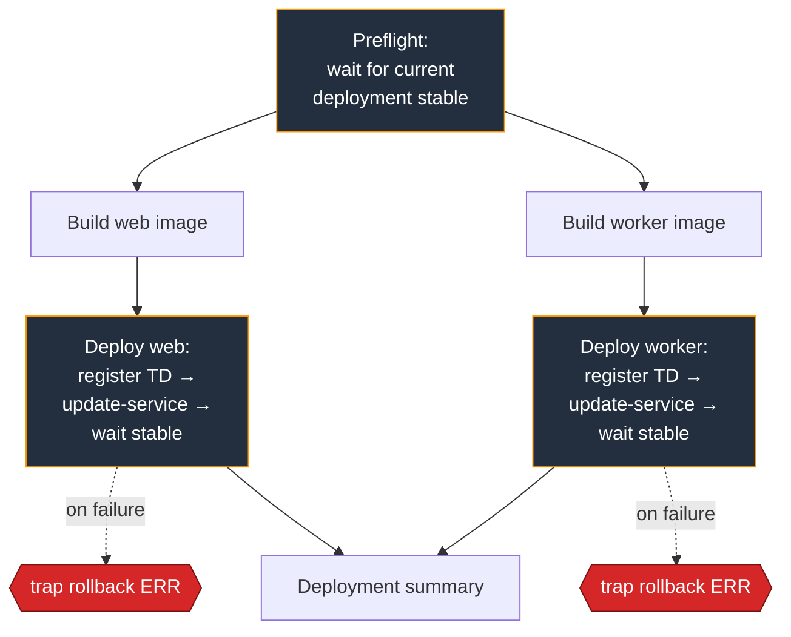

## Staging

### Overview

The `Staging` workflow builds the `web` and `worker` container images from the latest commit on `main`, pushes them to the shared `sandpiper` ECR repository tagged with the 7-character commit SHA, and rolls the staging ECS services onto the new images.

The workflow is the single path by which code reaches the staging environment. Every commit to `main` produces a deployable image; that same image is later promoted (by tag, not rebuild) to production by the release workflow.

Key properties:

- **Trigger:** push to `main`, or manual via `workflow_dispatch`
- **Concurrency:** group `staging-deployment`, in-progress runs are cancelled by newer pushes
- **Auth:** GitHub OIDC → dedicated staging IAM role (`staging-nto-sandpiper-cicd`)
- **Image registry:** ECR repo `sandpiper`, tagged `<short-sha>` (web) and `<short-sha>-worker` (worker)
- **Deploy target:** ECS cluster `staging-nto`, services `nto-staging-pipeline-svc` and `nto-staging-pipeline-worker-svc`
- **Safety:** a preflight job blocks the build until any in-flight ECS deployment has stabilised; the deploy job traps errors and rolls back to the previous task definition revision
<details>
<summary><b>GitHub Action Trigger</b></summary>
The workflow runs on:

- Any push to `main` (the normal path — PR merge)
- Manual dispatch from the Actions UI (`workflow_dispatch`)
  A concurrency group named `staging-deployment` with `cancel-in-progress: true` ensures that if a second push lands while a deploy is mid-flight, the older run is cancelled. Only the newest commit on `main` is deployed.



</details>
<details>
<summary><b>GitHub to AWS Authentication</b></summary>
Authentication uses **GitHub OIDC** — no long-lived AWS access keys are stored in the repo or GitHub environment.
 
Each reusable workflow that talks to AWS declares `permissions: id-token: write`, which lets the runner request a short-lived OIDC token. That token is exchanged for temporary AWS credentials via `aws-actions/configure-aws-credentials@v6.0.0`, assuming the IAM role pinned to the `staging` GitHub environment.
 
The role on the AWS side is `staging-nto-sandpiper-cicd` (defined in `github-oidc.tf`). Its trust policy restricts `sts:AssumeRoleWithWebIdentity` to a single `sub`:
 
```
repo:National-Tutoring-Observatory/sandpiper:environment:staging
```
 
This means only workflows that explicitly declare `environment: staging` on the job can assume it. Production has its own role with its own trust policy.
 
**Variables and secrets looked up by the workflow** (resolved from the `staging` GitHub environment):
 
| Name | Type | Used by | Purpose |
|---|---|---|---|
| `AWS_ROLE_ARN` | var | all jobs that hit AWS | The staging CI/CD role ARN |
| `BULLMQ_PRO_TOKEN` | secret | build jobs | Yarn registry token for the BullMQ Pro package |
| `ECR_REPOSITORY` | var | `ecs_build_image.yml` | ECR repo name (`sandpiper`) |
| `ECS_CLUSTER` | var | preflight + deploy | `staging-nto` |
| `ECS_SERVICE` | var | preflight + deploy (web) | `nto-staging-pipeline-svc` |
| `ECS_CONTAINER_NAME` | var | deploy (web) | Container name inside the web task definition |
| `ECS_WORKER_CLUSTER` | var | deploy (worker) | `staging-nto` |
| `ECS_WORKER_SERVICE` | var | deploy (worker) | `nto-staging-pipeline-worker-svc` |
| `ECS_WORKER_CONTAINER_NAME` | var | deploy (worker) | Container name inside the worker task definition |
 

 
</details>
<details>
<summary><b>AWS ECR</b></summary>
Both images live in a **single shared ECR repository**, `sandpiper`. Web and worker are distinguished only by their tag suffix:
 
- Web image tag: `<short-sha>` (e.g. `e6d8d50`)
- Worker image tag: `<short-sha>-worker` (e.g. `e6d8d50-worker`)
The short SHA is the first 7 characters of `GITHUB_SHA`, derived inside `ecs_build_image.yml`. This same tagging convention is what `inspect_staging.yml` later validates during a production release, and what `ecs_promote_image.yml` re-tags as `vX.Y.Z` when promoting to production. Keeping web and worker in one repo, distinguished only by suffix, is what makes that re-tag operation symmetric.
 
The build job (`ecs_build_image.yml`):
 
1. Configures AWS credentials via OIDC (see auth section)
2. Logs in to ECR with `aws-actions/amazon-ecr-login@v2`
3. Resolves `ACCOUNT_ID` via `sts get-caller-identity` and builds the full ECR URI: `<account>.dkr.ecr.us-east-1.amazonaws.com/sandpiper`
4. `docker build` with the appropriate Dockerfile (`Dockerfile` for web, `workers/Dockerfile` for worker), passing the `BULLMQ_PRO_TOKEN` as a buildkit secret
5. `docker tag` to the full ECR URI and `docker push`
6. Emits the fully-qualified image URI as the job output (`image=<account>.dkr.ecr.us-east-1.amazonaws.com/sandpiper:<tag>`), which the downstream deploy job consumes

 
</details>
<details>
<summary><b>AWS ECS Task Definitions</b></summary>
The workflow does **not** register task definitions from a JSON file in the repo. Instead, the deploy job (`ecs_deploy_service.yml`) takes the live task definition currently attached to the service, swaps the container image, and registers the result as a new revision. This means changes to env vars, secrets, CPU/memory, etc. are managed in Terraform (`ecs.tf`) and applied out-of-band; the CI/CD pipeline only ever changes the `image` field.
 
The relevant Terraform definitions are `aws_ecs_task_definition.app` (web) and `aws_ecs_task_definition.worker`, both of which use `lifecycle { ignore_changes = [task_definition] }` on the corresponding services so that Terraform doesn't fight the deploy pipeline's revisions.
 
Inside the deploy job, for the chosen service (`web` or `worker`):
 
1. `aws ecs describe-services` → capture the current task definition ARN as `OLD_TD_ARN` (used by the rollback trap)
2. `aws ecs describe-task-definition` → dump the full task def to `td.json`
3. `jq` rewrites it:
   - Replace `image` on the container whose `name` matches the configured container name
   - Strip the read-only fields ECS rejects on register: `revision`, `status`, `taskDefinitionArn`, `requiresAttributes`, `compatibilities`, `registeredAt`, `registeredBy`
4. `aws ecs register-task-definition --cli-input-json file://td-register.json` → returns `NEW_TD_ARN`

 
</details>
<details>
<summary><b>AWS ECS Deployments</b></summary>
A staging deploy has three sequential phases per service. Web and worker run in parallel — both go through preflight → build → deploy, then both feed into a single summary job at the end.
 
**1. Preflight (`ecs_preflight.yml`).** Before any build runs, the preflight job polls `describe-services` until the service has exactly one deployment with `rolloutState = COMPLETED`. It polls every 30s for up to 600s (10 minutes). If a previous deploy is still rolling out, the new run waits rather than racing it. This avoids the case where two pushes to `main` in quick succession both try to register new task definitions against a service that hasn't yet stabilised.
 
**2. Deploy with rollback (`ecs_deploy_service.yml`).** After the new task definition is registered (see previous section), the deploy job:
 
1. `aws ecs update-service --task-definition $NEW_TD_ARN` — points the service at the new revision
2. `aws ecs wait services-stable` — blocks until `runningCount == desiredCount` and the new deployment reaches `COMPLETED`
3. The job installs a `trap rollback ERR` before any of this; if any AWS command fails, the trap fires and calls `update-service` with `$OLD_TD_ARN`, then waits for the service to stabilise on the old revision. The trap is cleared (`trap - ERR`) only after a successful deploy.
This is the pipeline's last line of defence. ECS itself also has a circuit breaker configured in Terraform (`deployment_circuit_breaker { enable = true, rollback = true }`), which will roll back automatically if tasks fail to start or fail health checks. The trap covers the cases the circuit breaker doesn't — e.g. an AWS API error mid-deploy, or `wait services-stable` timing out.
 
**3. Summary (`deployment_summary.yml`).** Once both services have deployed, the summary job writes a markdown table to `$GITHUB_STEP_SUMMARY` listing the deployed image URIs, total run duration, per-job timings, and the slowest job on the critical path.
 

 
</details>
